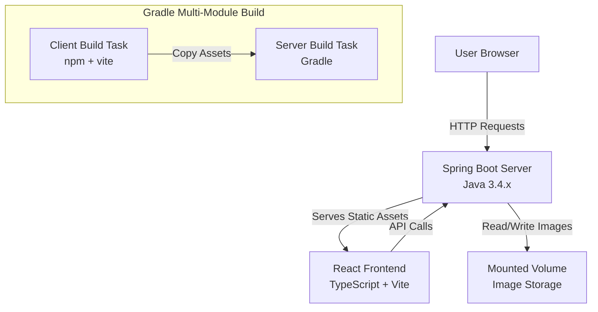

# Design Document: Set-Aside-Vault

## Overview

Set-Aside-Vault is a full-stack image gallery application built with a React/TypeScript frontend and Java Spring Boot backend. The application follows a multi-module Gradle build structure where the client build artifacts are integrated into the server's static resources, creating a single deployable JAR file.

The architecture emphasizes simplicity: no authentication, no complex state management, and straightforward file-based storage on a Railway-mounted volume. The development approach is phased, starting with frontend design using mock data, then later integrating real backend storage and database functionality.

## Architecture

### High-Level Architecture



### Module Structure

```
set-aside-vault/
├── client/                    # React + TypeScript + Vite (npm-based, no Gradle)
│   ├── src/
│   │   ├── components/       # React components
│   │   ├── services/         # API service layer
│   │   ├── types/            # TypeScript type definitions
│   │   └── App.tsx           # Main application component
│   ├── package.json          # npm dependencies and scripts
│   ├── vite.config.ts        # Vite build configuration
│   └── tsconfig.json         # TypeScript configuration
├── server/                    # Spring Boot application (Gradle-based)
│   ├── src/main/
│   │   ├── java/
│   │   │   └── com/vault/
│   │   │       ├── controller/   # REST controllers
│   │   │       ├── service/      # Business logic
│   │   │       ├── model/        # Data models
│   │   │       └── config/       # Configuration classes
│   │   └── resources/
│   │       ├── static/           # Client build artifacts (JS, CSS) - populated by build
│   │       ├── templates/        # index.html - populated by build
│   │       └── application.yml   # Spring configuration
│   └── build.gradle          # Server module Gradle build (includes client build tasks)
├── build.gradle               # Root build configuration
├── settings.gradle            # Multi-module settings (includes 'client' and 'server')
├── nixpacks.toml             # Railway build configuration
└── railway.json              # Railway deployment configuration
```

**Note:** The client folder does not have a build.gradle file because it's a Node.js project managed by npm. The server's build.gradle file contains tasks that invoke npm commands to build the client. Gradle's settings.gradle includes 'client' as a module for organizational purposes, but the client build is executed via npm/Vite, not Gradle's Java build process.

### Deployment Architecture

The application deploys to Railway as a single Spring Boot JAR:
- Railway uses Nixpacks to build the application with JDK 21
- Gradle builds the client first, then the server
- Client assets are bundled into the server JAR
- Spring Boot serves both the frontend and API endpoints
- Images are stored on a Railway-mounted volume at a configured path
- The application binds to Railway's dynamic $PORT variable

## Components and Interfaces

### Frontend Components

#### 1. Gallery Component
**Responsibility:** Display image collections in a grid layout

**Props:**
```typescript
interface GalleryProps {
  collections: ImageCollection[];
  onImageClick?: (image: Image) => void;
}
```

**Behavior:**
- Renders image collections in a responsive grid
- Handles image loading states
- Provides visual feedback for image interactions

#### 2. Upload Component
**Responsibility:** Handle image upload interface

**Props:**
```typescript
interface UploadProps {
  onUploadComplete: (collection: ImageCollection) => void;
  onUploadError: (error: Error) => void;
}
```

**Behavior:**
- Provides file selection interface (drag-and-drop or file picker)
- Shows upload progress
- Validates file types (images only)
- Calls API service to upload files

#### 3. App Component
**Responsibility:** Main application container and state management

**State:**
```typescript
interface AppState {
  collections: ImageCollection[];
  loading: boolean;
  error: string | null;
}
```

**Behavior:**
- Fetches initial gallery data on mount
- Manages global application state
- Coordinates between Gallery and Upload components

### Frontend Services

#### API Service
**Responsibility:** Abstract HTTP communication with backend

```typescript
interface ApiService {
  fetchCollections(): Promise<ImageCollection[]>;
  uploadImages(files: File[]): Promise<ImageCollection>;
}
```

**Implementation Notes:**
- Uses fetch API or axios for HTTP requests
- Handles error responses and network failures
- Provides mock implementation for Phase 1 development

### Frontend Types

```typescript
interface Image {
  id: string;
  url: string;
  filename: string;
  uploadedAt: Date;
}

interface ImageCollection {
  id: string;
  name: string;
  images: Image[];
  createdAt: Date;
}
```

### Backend Components

#### 1. ImageController
**Responsibility:** REST API endpoints for image operations

**Endpoints:**
```java
@RestController
@RequestMapping("/api/images")
public class ImageController {
    
    @GetMapping("/collections")
    public ResponseEntity<List<ImageCollectionDTO>> getCollections();
    
    @PostMapping("/upload")
    public ResponseEntity<ImageCollectionDTO> uploadImages(
        @RequestParam("files") MultipartFile[] files
    );
    
    @GetMapping("/file/{filename}")
    public ResponseEntity<Resource> getImage(@PathVariable String filename);
}
```

#### 2. ImageService
**Responsibility:** Business logic for image management

```java
public interface ImageService {
    List<ImageCollectionDTO> getAllCollections();
    ImageCollectionDTO uploadImages(MultipartFile[] files) throws IOException;
    Resource loadImageAsResource(String filename) throws IOException;
}
```

**Implementation Notes:**
- Generates unique filenames to prevent collisions
- Organizes images into collections
- Handles file I/O operations with the mounted volume
- Phase 1: In-memory storage of metadata
- Phase 2: Database persistence of metadata

#### 3. StorageService
**Responsibility:** Low-level file storage operations

```java
public interface StorageService {
    String store(MultipartFile file) throws IOException;
    Resource loadAsResource(String filename) throws IOException;
    void init() throws IOException;
}
```

**Implementation Notes:**
- Manages the mounted volume directory
- Creates necessary subdirectories
- Handles file naming and path resolution
- Validates storage availability

#### 4. StaticResourceConfiguration
**Responsibility:** Configure Spring Boot to serve frontend assets

```java
@Configuration
public class StaticResourceConfiguration implements WebMvcConfigurer {
    
    @Override
    public void addResourceHandlers(ResourceHandlerRegistry registry) {
        // Configure static resource locations
        // Configure image serving from mounted volume
    }
}
```

### Backend Models

```java
public class ImageCollectionDTO {
    private String id;
    private String name;
    private List<ImageDTO> images;
    private LocalDateTime createdAt;
}

public class ImageDTO {
    private String id;
    private String url;
    private String filename;
    private LocalDateTime uploadedAt;
}
```

## Data Models

### Phase 1: In-Memory Storage

During Phase 1, the application uses in-memory data structures:

```java
// In ImageService implementation
private final Map<String, ImageCollectionDTO> collections = new ConcurrentHashMap<>();
```

Images are stored on the file system, but metadata (collection info, image references) is kept in memory. This allows frontend development without database complexity.

### Phase 2: Database Schema (Future)

```sql
CREATE TABLE image_collections (
    id VARCHAR(36) PRIMARY KEY,
    name VARCHAR(255) NOT NULL,
    created_at TIMESTAMP NOT NULL
);

CREATE TABLE images (
    id VARCHAR(36) PRIMARY KEY,
    collection_id VARCHAR(36) NOT NULL,
    filename VARCHAR(255) NOT NULL,
    url VARCHAR(512) NOT NULL,
    uploaded_at TIMESTAMP NOT NULL,
    FOREIGN KEY (collection_id) REFERENCES image_collections(id)
);
```

### File Storage Structure

```
/mounted-volume/
└── images/
    ├── {uuid-1}.jpg
    ├── {uuid-2}.png
    ├── {uuid-3}.jpg
    └── ...
```

Files are stored with UUID-based names to prevent collisions. Original filenames are preserved in metadata.

## Build System Design

### Gradle Multi-Module Configuration

**Root build.gradle:**
```gradle
plugins {
    id 'java'
}

subprojects {
    apply plugin: 'java'
}
```

**settings.gradle:**
```gradle
rootProject.name = 'set-aside-vault'
include 'server'
// Note: 'client' is not included as a Gradle module since it's npm-based
// The server build.gradle handles client building via npm commands
```

**Server build.gradle:**
```gradle
plugins {
    id 'java'
    id 'org.springframework.boot' version '3.4.x'
    id 'io.spring.dependency-management' version '1.1.x'
}

// Task to build client
task buildClient(type: Exec) {
    workingDir '../client'
    commandLine 'npm', 'install'
    commandLine 'npm', 'run', 'build'
}

// Task to copy client assets
task copyClientAssets(type: Copy, dependsOn: buildClient) {
    from '../client/dist'
    into 'src/main/resources/static'
    
    // Copy index.html separately to templates
    from('../client/dist') {
        include 'index.html'
        into '../templates'
    }
}

// Make server build depend on client build
processResources.dependsOn copyClientAssets
```

### Build Execution Flow

1. Developer runs `./gradlew build`
2. Gradle executes `buildClient` task
   - Runs `npm install` in client directory
   - Runs `npm run build` (Vite build)
   - Produces output in `client/dist/`
3. Gradle executes `copyClientAssets` task
   - Copies all files from `client/dist/` to `server/src/main/resources/static/`
   - Copies `index.html` to `server/src/main/resources/templates/`
4. Gradle executes `processResources` task
   - Includes copied client assets in server JAR
5. Gradle executes server compilation and packaging
6. Final output: `server/build/libs/server.jar` containing both frontend and backend

### Railway Deployment Configuration

**nixpacks.toml:**
```toml
[phases.setup]
nixPkgs = ['jdk21', 'nodejs']

[phases.build]
cmds = ['./gradlew build -x test']

[start]
cmd = 'java -jar server/build/libs/server.jar'
```

**railway.json:**
```json
{
  "build": {
    "builder": "NIXPACKS"
  },
  "deploy": {
    "startCommand": "java -Dserver.port=$PORT -jar server/build/libs/server.jar",
    "restartPolicyType": "ON_FAILURE",
    "restartPolicyMaxRetries": 10
  }
}
```

### Spring Boot Configuration

**application.yml:**
```yaml
server:
  port: ${PORT:8080}

spring:
  servlet:
    multipart:
      max-file-size: 10MB
      max-request-size: 50MB
  
storage:
  location: ${STORAGE_PATH:/tmp/uploads}

timezone: America/Chicago
```


## Correctness Properties

A property is a characteristic or behavior that should hold true across all valid executions of a system—essentially, a formal statement about what the system should do. Properties serve as the bridge between human-readable specifications and machine-verifiable correctness guarantees.

### Build System Properties

Property 1: Client assets integration
*For any* successful client build, all files from the client/dist directory should exist in server/src/main/resources/static after the build completes
**Validates: Requirements 1.4, 2.3**

Property 2: Build execution order
*For any* Gradle build execution, the client build artifacts should exist before the server build task processes resources
**Validates: Requirements 2.1**

Property 3: Index.html template placement
*For any* successful build, the index.html file should exist in server/src/main/resources/templates directory
**Validates: Requirements 2.4**

### Deployment Properties

Property 4: Dynamic port binding
*For any* valid port number provided via PORT environment variable, the server should bind to that port
**Validates: Requirements 3.4**

### Gallery Display Properties

Property 5: Complete collection display
*For any* set of image collections, the gallery component should render all collections without omission
**Validates: Requirements 4.1**

Property 6: Storage volume image loading
*For any* image displayed in the gallery, its URL should reference the configured storage volume path
**Validates: Requirements 4.3**

Property 7: Unauthenticated gallery access
*For any* request to view the gallery, the system should return the gallery content without requiring authentication credentials
**Validates: Requirements 4.4, 9.1**

### Upload Properties

Property 8: Image file acceptance
*For any* valid image file (JPEG, PNG, GIF, WebP), the upload service should accept the file without rejection
**Validates: Requirements 5.2**

Property 9: Storage volume persistence
*For any* uploaded image file, the file should exist in the configured storage volume directory after upload completes
**Validates: Requirements 5.3, 7.1, 7.4**

Property 10: Upload-fetch round trip
*For any* uploaded image collection, fetching all collections immediately after upload should include the newly uploaded collection with all its images
**Validates: Requirements 5.4**

Property 11: Multiple file upload handling
*For any* collection of valid image files uploaded together, all files should be stored and associated with the same collection
**Validates: Requirements 5.5**

### Static Serving Properties

Property 12: Static asset serving
*For any* file in the server/src/main/resources/static directory, requesting that file's path should return the file content
**Validates: Requirements 6.1, 6.3**

Property 13: Image file serving
*For any* image file in the storage volume, requesting the image via its URL should return the image content
**Validates: Requirements 6.4**

### Persistence Properties

Property 14: Restart persistence
*For any* image stored before a server restart, the image should remain accessible and retrievable after the server restarts
**Validates: Requirements 7.2**

### Authentication Properties

Property 15: Unauthenticated upload access
*For any* upload request without authentication credentials, the system should accept and process the upload
**Validates: Requirements 9.2**

## Error Handling

### File Upload Errors

**Invalid File Type:**
- Validation: Check file MIME type and extension
- Response: HTTP 400 Bad Request with descriptive error message
- User Feedback: Display error message in upload component

**File Size Exceeded:**
- Validation: Check against configured max file size (10MB per file, 50MB per request)
- Response: HTTP 413 Payload Too Large
- User Feedback: Display size limit and current file size

**Storage Full:**
- Detection: Catch IOException during file write
- Response: HTTP 507 Insufficient Storage
- User Feedback: Inform user to contact administrator

**Corrupted File:**
- Detection: Attempt to read image metadata
- Response: HTTP 400 Bad Request
- User Feedback: Inform user file is corrupted or invalid

### File Serving Errors

**File Not Found:**
- Detection: File doesn't exist in storage
- Response: HTTP 404 Not Found
- User Feedback: Display placeholder image or error message

**Read Permission Error:**
- Detection: IOException during file read
- Response: HTTP 500 Internal Server Error
- Logging: Log error with file path for debugging

### Build Errors

**Client Build Failure:**
- Detection: npm build returns non-zero exit code
- Response: Gradle build fails with clear error message
- Resolution: Check npm logs, verify dependencies

**Asset Copy Failure:**
- Detection: Copy task fails
- Response: Gradle build fails
- Resolution: Verify source and destination paths exist

### Configuration Errors

**Missing Storage Path:**
- Detection: Storage location not configured or doesn't exist
- Response: Application fails to start with clear error message
- Resolution: Set STORAGE_PATH environment variable or create directory

**Port Binding Failure:**
- Detection: Port already in use
- Response: Application fails to start
- Resolution: Change port or stop conflicting process

## Testing Strategy

### Dual Testing Approach

The application will use both unit tests and property-based tests to ensure comprehensive coverage:

- **Unit tests**: Verify specific examples, edge cases, and error conditions
- **Property tests**: Verify universal properties across all inputs

Both testing approaches are complementary and necessary. Unit tests catch concrete bugs and validate specific scenarios, while property-based tests verify general correctness across a wide range of inputs.

### Unit Testing

**Frontend Unit Tests (Vitest + React Testing Library):**
- Component rendering with specific props
- User interaction handling (clicks, file selection)
- Error state display
- Loading state display
- API service mock integration

**Backend Unit Tests (JUnit 5 + Mockito):**
- Controller endpoint responses
- Service layer business logic
- Error handling for specific scenarios
- Configuration loading
- File validation logic

**Example Unit Tests:**
- Upload component displays error when file type is invalid
- Gallery component shows loading spinner while fetching
- ImageService generates unique filenames
- StorageService creates directory if it doesn't exist
- Root path "/" returns index.html

### Property-Based Testing

**Property Testing Library:** 
- Frontend: fast-check (TypeScript)
- Backend: jqwik (Java)

**Configuration:**
- Minimum 100 iterations per property test
- Each test tagged with: **Feature: set-aside-vault, Property {number}: {property_text}**

**Frontend Property Tests:**
- Property 5: Gallery renders all collections (generate random collections, verify all rendered)
- Property 10: Upload-fetch round trip (upload random images, verify they appear in fetch)

**Backend Property Tests:**
- Property 4: Dynamic port binding (generate random valid ports, verify binding)
- Property 8: Image file acceptance (generate random valid image files, verify acceptance)
- Property 9: Storage volume persistence (upload random images, verify files exist in storage)
- Property 11: Multiple file upload (generate random number of files, verify all stored)
- Property 12: Static asset serving (generate random static files, verify serving)
- Property 13: Image file serving (generate random images, verify serving)
- Property 14: Restart persistence (store random images, simulate restart, verify accessibility)
- Property 15: Unauthenticated upload (generate random uploads without auth, verify acceptance)

**Build System Property Tests:**
- Property 1: Client assets integration (verify all dist files copied)
- Property 2: Build execution order (verify client artifacts exist before server build)
- Property 3: Index.html placement (verify index.html in templates)

### Integration Testing

**End-to-End Scenarios:**
- Complete upload flow: select files → upload → verify in gallery
- Gallery load on fresh application start
- Static asset serving through Spring Boot
- Image serving from storage volume

### Test Organization

```
client/
└── src/
    └── __tests__/
        ├── components/
        │   ├── Gallery.test.tsx
        │   └── Upload.test.tsx
        └── properties/
            ├── gallery.properties.test.ts
            └── upload.properties.test.ts

server/
└── src/test/java/
    └── com/vault/
        ├── controller/
        │   └── ImageControllerTest.java
        ├── service/
        │   └── ImageServiceTest.java
        └── properties/
            ├── UploadPropertiesTest.java
            ├── StoragePropertiesTest.java
            └── ServingPropertiesTest.java
```

### Testing During Phased Development

**Phase 1 (Current - Frontend with Mock Data):**
- Frontend unit tests with mock API responses
- Frontend property tests with generated mock data
- Build system tests
- Static serving tests

**Phase 2 (Future - Backend Integration):**
- Backend unit tests with real storage
- Backend property tests with file I/O
- Integration tests with real API calls
- Database persistence tests (when added)

## Implementation Notes

### Phase 1 Development Focus

The initial implementation focuses on:
1. Setting up the Gradle multi-module build system
2. Creating the React frontend with mock data
3. Implementing the upload UI (non-functional in Phase 1)
4. Configuring Spring Boot to serve static assets
5. Ensuring local development workflow works smoothly

### Phase 2 Additions

Future work will include:
1. Implementing real file upload handling
2. Adding database for metadata persistence
3. Implementing collection management features
4. Adding image metadata (EXIF data, dimensions)
5. Implementing image thumbnails for performance

### Development Workflow

**Local Development:**
```bash
# Build everything
./gradlew build

# Run server (serves frontend + API)
./gradlew :server:bootRun

# Frontend development (with hot reload)
cd client
npm run dev
# Configure Vite proxy to point to Spring Boot server
```

**Railway Deployment:**
```bash
# Railway automatically runs:
./gradlew build -x test
java -Dserver.port=$PORT -jar server/build/libs/server.jar
```

### Key Design Decisions

1. **Single JAR Deployment**: Frontend assets bundled into Spring Boot JAR for simplicity
2. **No Authentication**: Simplifies initial implementation, can be added later
3. **File-Based Storage**: Uses mounted volume instead of object storage for simplicity
4. **In-Memory Metadata (Phase 1)**: Allows frontend development without database complexity
5. **UUID Filenames**: Prevents collisions and security issues with user-provided names
6. **Phased Approach**: Validates frontend design before backend complexity
