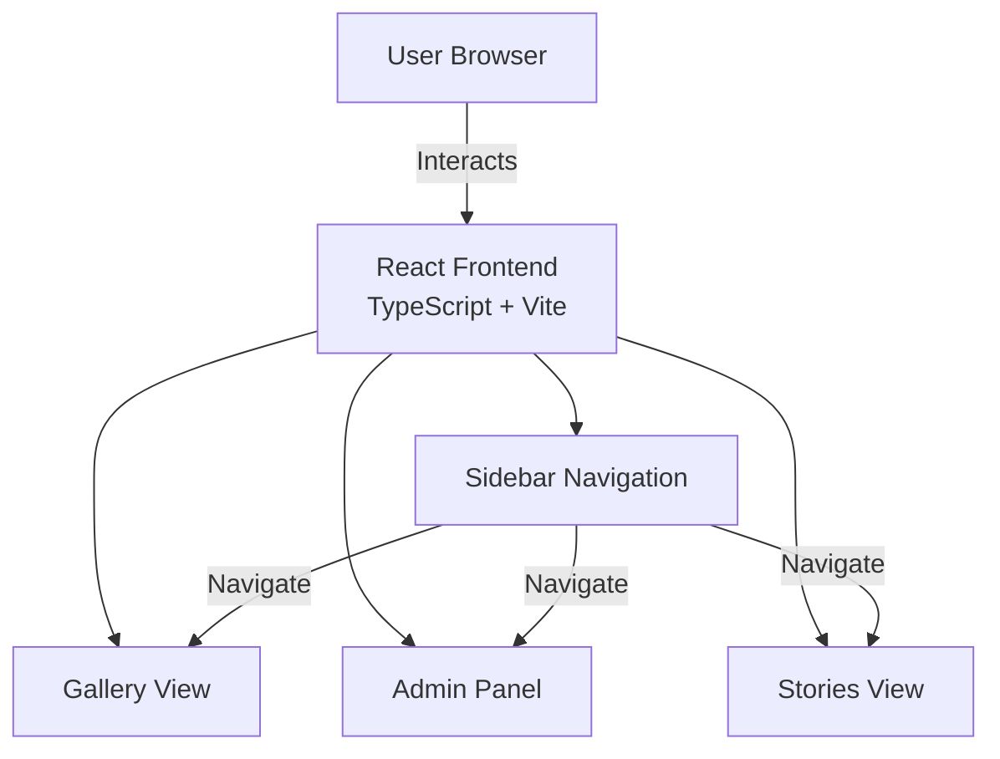

# Design Document: Set-Aside-Vault

## Overview

Set-Aside-Vault is a personal image gallery and collection management application with a modern React/TypeScript frontend. The application emphasizes a clean, professional user interface with features for organizing collections, managing items with flexible metadata, and sharing stories about treasured possessions.

The current implementation focuses on the frontend with a polished UI, flexible data models, and comprehensive admin functionality. The architecture uses a slate/charcoal color theme with glass-morphism effects, smooth animations, and an intuitive navigation structure.

## Architecture

### High-Level Architecture



### Component Structure

```
client/
├── src/
│   ├── components/
│   │   ├── Gallery.tsx          # Main gallery with spotlight effect
│   │   ├── Gallery.css          # Gallery styling
│   │   ├── CollectionCarousel.tsx  # All collections carousel view
│   │   ├── CollectionCarousel.css
│   │   ├── Admin.tsx            # Admin panel with CRUD wizards
│   │   ├── Admin.css
│   │   ├── Stories.tsx          # Stories display
│   │   ├── Stories.css
│   │   ├── Upload.tsx           # Upload component (legacy)
│   │   └── Upload.css
│   ├── services/
│   │   └── api.ts              # API service with mock data
│   ├── types/
│   │   └── index.ts            # TypeScript type definitions
│   ├── App.tsx                 # Main app with routing
│   ├── App.css                 # App-level styling
│   ├── index.css               # Global styles and CSS variables
│   └── main.tsx                # Entry point
├── package.json
├── vite.config.ts
└── tsconfig.json
```

## Data Models

### Core Types

```typescript
export type AspectRatio = 'square' | 'portrait' | 'landscape';

export interface Item {
  // Core fields
  id: string;
  collectionId?: string;
  url: string;
  title: string;              // Display title
  filename: string;           // Original filename
  uploadedAt: Date;
  
  // Flexible metadata (key-value pairs)
  metadata?: Record<string, string>;
}

export interface Collection {
  // Core fields
  id: string;
  name: string;
  items: Item[];
  createdAt: Date;
  coverPhoto?: string;
  aspectRatio: AspectRatio;   // Display aspect ratio for items
  
  // Flexible metadata (key-value pairs)
  metadata?: Record<string, string>;
}

export interface Story {
  id: string;
  title: string;
  content: string;
  createdAt: Date;
  updatedAt?: Date;
  itemId?: string;            // Optional link to item
  collectionId?: string;      // Optional link to collection
  coverImage?: string;
  tags?: string[];
}
```

### Design Rationale

**Flexible Metadata:**
- Items and Collections use `Record<string, string>` for metadata instead of rigid fields
- Allows users to define custom fields without schema changes
- Metadata is displayed dynamically in the UI
- Examples: Description, Condition, Price, Acquired date, Tags, etc.

**Aspect Ratios:**
- Collections define how their items should be displayed
- `square` (1:1): Memorabilia, figures
- `portrait` (2:3): Trading cards
- `landscape` (3:2): Photos
- Gallery grid adjusts column width based on aspect ratio

## Components and Features

### 1. Sidebar Navigation

**Location:** Fixed left sidebar (280px width)

**Features:**
- Main navigation items (All Collections, Stories, Admin)
- Collections list with cover photo thumbnails (40x40px)
- Active state highlighting with gradient background
- Item count badges for each collection

**Styling:**
- Slate/charcoal background (rgb(51, 65, 85))
- Glass-morphism effects
- Smooth hover transitions

### 2. Gallery Component

**Responsibility:** Display items in a responsive grid with spotlight effect

**Key Features:**
- **Responsive Grid:** Adjusts based on collection's aspect ratio
  - Portrait: 280px min width
  - Square: 320px min width
  - Landscape: 360px min width
- **Spotlight Effect:**
  - Click item to spotlight (scales 1.15x, white border, shadow)
  - Other items dim to 30% opacity with grayscale
  - Smooth scroll-to-center before spotlight activates
  - Auto-dismiss on scroll (50px threshold)
  - Auto-dismiss when changing collections
  - Clear previous spotlight before applying new one (100ms delay)
- **Metadata Panel:**
  - Slides out from behind spotlighted item
  - Same size as spotlighted card
  - Smart positioning (left/right based on card position)
  - Displays title and dynamic metadata fields
  - Collapse button (« or ») to close
  - No transitions on position (instant snap)
- **Bottom Gradient:** Subtle fade effect at bottom of viewport
- **Dynamic Padding:** 
  - 0px top normally, 150px when spotlight active
  - 150px bottom always (for scroll-to-center functionality)

**Props:**
```typescript
interface GalleryProps {
  collections: Collection[];
  loading?: boolean;
  singleCollection?: boolean;
}
```

### 3. Collection Carousel

**Responsibility:** Display all collections in an infinite scrolling carousel

**Features:**
- Large cards (400x500px) showing collection cover photos
- 60-second loop animation (pauses on hover)
- Gradient overlay on cards
- Shows collection name and item count on hover
- Smooth infinite scroll effect

**Location:** Home page (All Collections view)

### 4. Admin Panel

**Responsibility:** Complete CRUD operations for Collections, Items, and Stories

**Structure:**
- **Step 1:** Select category (Collections & Items / Stories)
- **Step 2:** Choose action type
  - **Create Section:** Hierarchical buttons
    - Collection button
    - Item button (indented with ↳ arrow)
  - **Manage Section:** Edit/Delete buttons for each type

**Wizards:**

**Create Collection:**
- Name (required)
- Aspect Ratio (required): Square/Portrait/Landscape radio buttons
- Cover Photo (required): File upload with preview
- Metadata (required): Dynamic key-value pairs (at least one)

**Create Item:**
- Collection selection (required): Dropdown
- Title (required)
- Image (required): File upload with preview
- Metadata (required): Dynamic key-value pairs (at least one)
- TODO: Preview should match target collection's aspect ratio

**Create Story:**
- Title (required)
- Content (required): Large textarea
- Cover Image (optional): File upload with preview
- Link to Collection (optional): Dropdown
- Link to Item (optional): Dropdown (shows when collection selected)
- Metadata (optional): Dynamic key-value pairs

**Edit Wizards:**
- Select existing item from dropdown
- Pre-populate form with existing data (TODO: needs backend)
- Update button

**Delete Wizards:**
- Select item from dropdown
- Show warning with red alert box
- Confirm deletion with red button

**Styling:**
- Professional slate/charcoal theme
- Clean borders, no bright gradients
- Red styling for delete actions
- Form validation (disabled buttons until requirements met)

### 5. Stories Component

**Responsibility:** Display collection stories

**Features:**
- Grid layout of story cards
- Each card shows: cover image, title, date, collection badge, content preview
- No header (removed for cleaner look)

### 6. Stats Dashboard

**Location:** Home page, above carousel

**Features:**
- Subtle stats display
- Shows: Collections count, Items count, Stories count
- Minimal, professional styling

## Styling System

### Color Palette

**Primary Colors:**
- Background: rgb(51, 65, 85) - Slate/charcoal
- Text Primary: var(--gray-900)
- Text Secondary: var(--gray-600)
- Border: var(--border)

**Accent Colors:**
- Primary: var(--primary) - Indigo
- Secondary: var(--secondary) - Purple
- Delete/Danger: #ef4444 - Red

### CSS Variables

Defined in `client/src/index.css`:
- `--primary`: Indigo gradient start
- `--secondary`: Purple gradient end
- `--gray-*`: Gray scale (50-900)
- `--border`: Border color
- `--shadow`: Box shadow
- `--shadow-xl`: Large box shadow
- `--transition`: Standard transition timing

### Design Principles

1. **Professional & Mature:** No "kid-made" aesthetics
2. **Glass-morphism:** Subtle backdrop blur effects
3. **Smooth Animations:** Cubic-bezier easing for natural motion
4. **Consistent Spacing:** 1rem base unit
5. **Responsive:** Mobile-first approach
6. **Accessibility:** Proper contrast ratios, semantic HTML

## Routing

**Routes:**
- `/` - Home (All Collections carousel + stats)
- `/collection/:id` - Single collection gallery view
- `/stories` - Stories page
- `/admin` - Admin panel
- `/upload` - Legacy upload page (redirects to admin)

**Navigation:**
- React Router DOM for client-side routing
- Sidebar navigation for main routes
- Collection list in sidebar for direct collection access

## State Management

**Current Approach:** React useState hooks

**State Locations:**
- **App.tsx:** Collections data, loading states
- **Gallery.tsx:** Spotlight state, metadata panel state, scroll positions
- **Admin.tsx:** Form states, wizard step state, preview states

**Future Considerations:**
- Context API for global state (collections, user preferences)
- React Query for server state management (when backend integrated)

## Mock Data

**Location:** `client/src/services/api.ts`

**Collections:**
1. Baseball Cards (15 items, portrait)
2. Baseball Auto (8 items, square)
3. Farm Country (4 items, landscape)
4. SH Figuarts (2 items, square)
5. Pokemon (3 items, portrait)

**Sample Metadata:**
- First two Baseball Cards items have full metadata (Description, Condition, Price, Acquired, Tags)
- Other items have minimal data

## Key Implementation Details

### Spotlight Effect Logic

1. User clicks item
2. If another item is spotlighted:
   - Clear spotlight (100ms pause)
3. Scroll item to center (smooth, 300ms)
4. Apply spotlight effect
5. Calculate metadata panel position (350ms delay)
6. Display metadata panel (instant, no transition)

### Metadata Display

- Metadata panel loops through `metadata` object
- Displays each key-value pair dynamically
- No hardcoded fields
- Title shown at top
- Collapse button on edge closest to card

### Admin Form Validation

**Collection:**
- Name must have text
- Cover photo must be uploaded
- At least one metadata field required

**Item:**
- Collection must be selected
- Title must have text
- Image must be uploaded
- At least one metadata field required

**Story:**
- Title must have text
- Content must have text
- Other fields optional

### Aspect Ratio Grid Behavior

**Portrait (2:3):**
- Grid: `repeat(auto-fill, minmax(280px, 1fr))`
- Cards: `aspect-ratio: 2/3`

**Square (1:1):**
- Grid: `repeat(auto-fill, minmax(320px, 1fr))`
- Cards: `aspect-ratio: 1`

**Landscape (3:2):**
- Grid: `repeat(auto-fill, minmax(360px, 1fr))`
- Cards: `aspect-ratio: 3/2`

## Future Enhancements

### Backend Integration
- Spring Boot REST API
- File storage on mounted volume
- Database for metadata persistence
- Real upload/edit/delete operations

### Additional Features
- Search and filter collections
- Bulk operations (multi-select)
- Image editing (crop, rotate)
- Export collections
- Sharing and permissions
- Tags and categories
- Advanced metadata fields (dates, numbers, dropdowns)

### Performance Optimizations
- Image lazy loading (already implemented)
- Thumbnail generation
- Virtual scrolling for large collections
- Image compression

### User Experience
- Keyboard navigation
- Drag-and-drop reordering
- Undo/redo operations
- Favorites/bookmarks
- Collection templates

## Testing Strategy

### Current Testing Needs

**Component Tests:**
- Gallery rendering with different aspect ratios
- Spotlight effect behavior
- Metadata panel positioning
- Admin form validation
- Routing navigation

**Integration Tests:**
- Complete CRUD workflows
- Upload → Display flow
- Edit → Update flow
- Delete → Remove flow

**Visual Regression Tests:**
- Spotlight animations
- Metadata panel transitions
- Responsive layouts
- Theme consistency

### Future Testing (with Backend)

**API Tests:**
- CRUD endpoints
- File upload handling
- Error responses
- Authentication (if added)

**E2E Tests:**
- Complete user workflows
- Cross-browser compatibility
- Mobile responsiveness

## Development Workflow

**Local Development:**
```bash
# Install dependencies
cd client
npm install

# Run dev server (hot reload)
npm run dev

# Build for production
npm run build
```

**Code Organization:**
- Components in `src/components/`
- Each component has its own CSS file
- Shared types in `src/types/`
- API service in `src/services/`
- Global styles in `src/index.css`

**Naming Conventions:**
- Components: PascalCase (Gallery.tsx)
- CSS files: Match component name (Gallery.css)
- CSS classes: kebab-case (metadata-card)
- TypeScript interfaces: PascalCase (GalleryProps)

## Design Decisions

1. **Flexible Metadata:** Record<string, string> instead of rigid schema
2. **Aspect Ratios:** Collection-level setting for consistent display
3. **Spotlight Effect:** Enhances focus without modal overlay
4. **Hierarchical Admin:** Clear parent-child relationship (Collection → Item)
5. **No Authentication:** Simplifies initial implementation
6. **Mock Data First:** Validates UX before backend complexity
7. **Professional Theme:** Slate/charcoal for mature aesthetic
8. **Dynamic Metadata Display:** Loop-based rendering for flexibility

## Design Decisions

1. **Flexible Metadata:** Record<string, string> instead of rigid schema
2. **Aspect Ratios:** Collection-level setting for consistent display
3. **Spotlight Effect:** Enhances focus without modal overlay
4. **Hierarchical Admin:** Clear parent-child relationship (Collection → Item)
5. **No Authentication:** Simplifies initial implementation
6. **Mock Data First:** Validates UX before backend complexity
7. **Professional Theme:** Slate/charcoal for mature aesthetic
8. **Dynamic Metadata Display:** Loop-based rendering for flexibility
